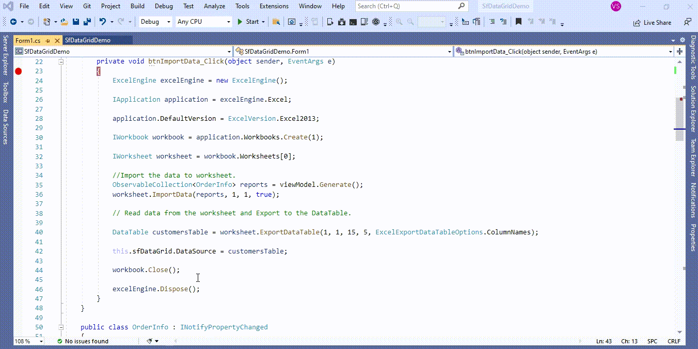

# How to import the data from excel to WinForms DataGrid (SfDataGrid)?

## About the sample
This example illustrates how to import the data from excel to [WinForms DataGrid](https://www.syncfusion.com/winforms-ui-controls/datagrid) (SfDataGrid)?

You can read the data from Excel using **IWorkSheet.ExportDataTable** method and convert the data to a DataTable collection in [WinForms DataGrid](https://www.syncfusion.com/winforms-ui-controls/datagrid) (SfDataGrid). You can then set the DataTable collection as [DataSource](https://help.syncfusion.com/cr/windowsforms/Syncfusion.WinForms.DataGrid.SfDataGrid.html#Syncfusion_WinForms_DataGrid_SfDataGrid_DataSource) of [WinForms DataGrid](https://www.syncfusion.com/winforms-ui-controls/datagrid) (SfDataGrid). Using this way, you can import the data from Excel to [WinForms DataGrid](https://www.syncfusion.com/winforms-ui-controls/datagrid) (SfDataGrid). Refer the below code example for more details.

```C#

private void btnImportData_Click(object sender, EventArgs e)
{
    ExcelEngine excelEngine = new ExcelEngine();

    IApplication application = excelEngine.Excel;

    application.DefaultVersion = ExcelVersion.Excel2013;

    IWorkbook workbook = application.Workbooks.Create(1);

    IWorksheet worksheet = workbook.Worksheets[0];

    //Import the data to worksheet.
    ObservableCollection<OrderInfo> reports = viewModel.Generate();
    worksheet.ImportData(reports, 1, 1, true);

    // Read data from the worksheet and Export to the DataTable.

    DataTable customersTable = worksheet.ExportDataTable(1, 1, 15, 5, ExcelExportDataTableOptions.ColumnNames);

    this.sfDataGrid.DataSource = customersTable;

    workbook.Close();

    excelEngine.Dispose();
}

```



Refer [here](https://help.syncfusion.com/file-formats/xlsio/working-with-data#exporting-from-worksheet-to-data-table) for more details about import data from excel to Grid.

## Requirements to run the demo
Visual Studio 2015 and above versions
